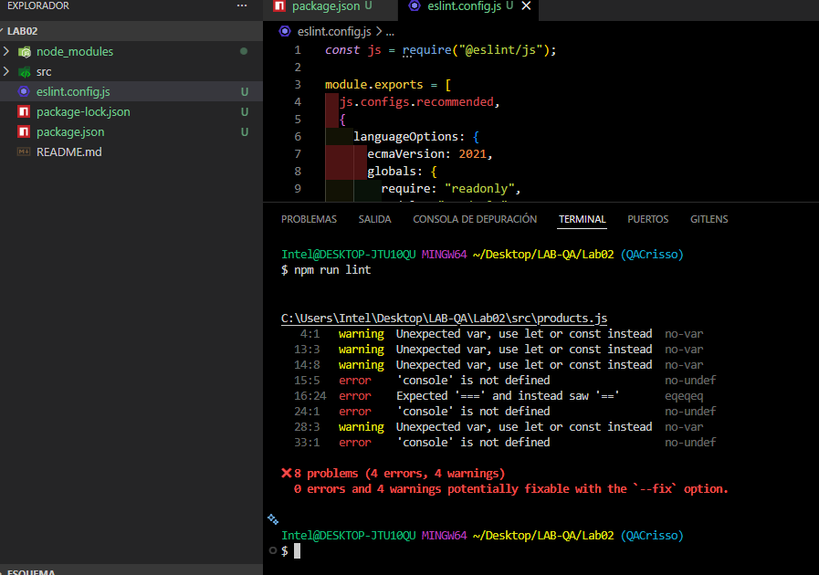
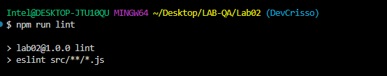
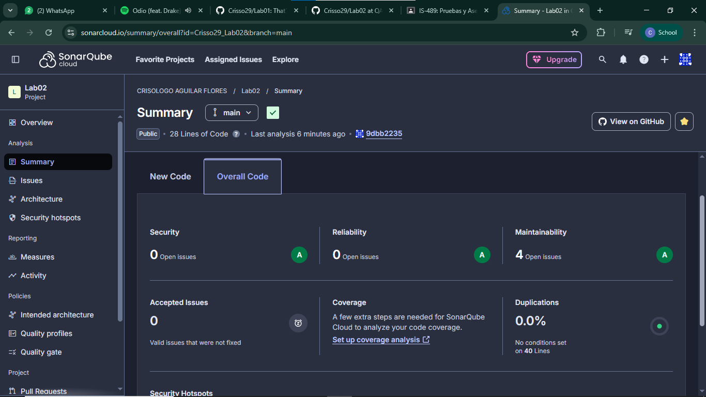
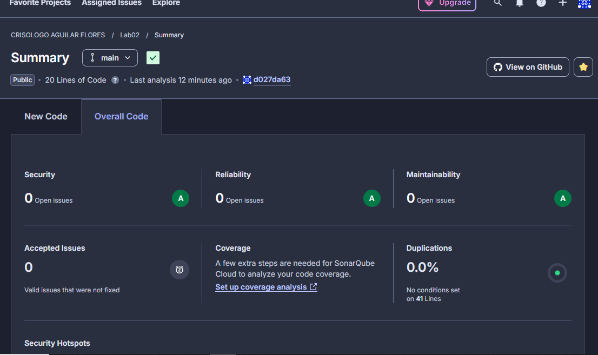
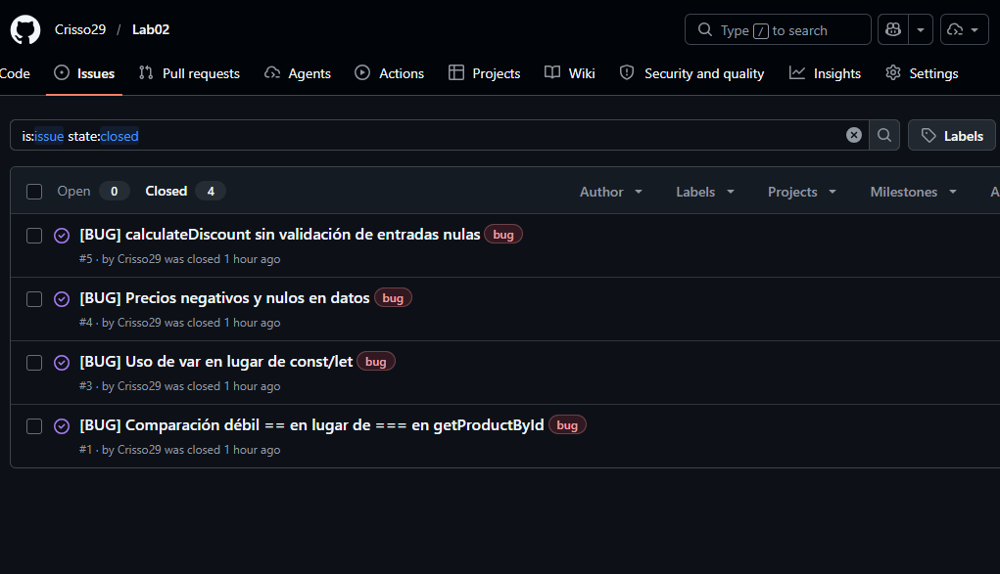
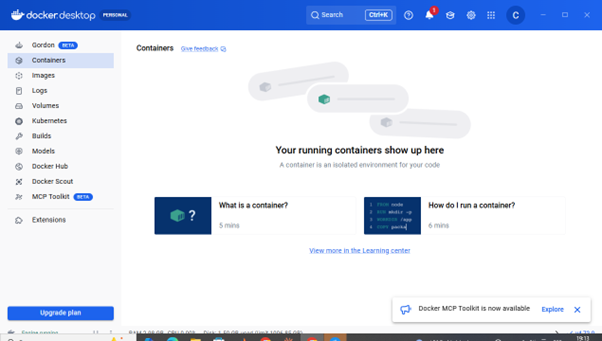
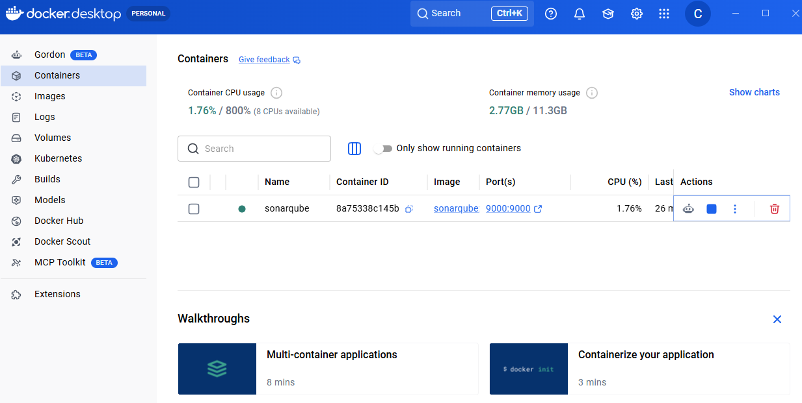

# Informe de Revisión Estática — Laboratorio 02
## IS-489 Pruebas y Aseguramiento de Calidad de Software

---

## Datos del equipo

| Campo | Valor |
|-------|-------|
| Integrante | Crisólogo Aguilar Flores |
| Docente | Ing. Lizbeth Jaico Quispe |
| Fecha | 09/05/2026 |
| Módulo revisado | src/products.js |
| Repositorio | https://github.com/Crisso29/Lab02 |
| URL SonarCloud | https://sonarcloud.io/summary/overall?id=Crisso29_Lab02 |
| URL SonarQube Local | http://localhost:9000/dashboard?id=Lab02 |

---

## Herramientas utilizadas

- ESLint 10.x con reglas: eqeqeq, no-var, no-unused-vars, prefer-const
- SonarCloud — análisis automático conectado con GitHub
- SonarQube Community Edition — análisis local con Docker
- Checklist manual (7 criterios)

---

## Flujo de trabajo
---

## Análisis ESLint — ANTES

❌ 8 problemas (4 errores, 4 advertencias)



---

## Análisis ESLint — DESPUÉS

✅ 0 problemas



---

## Análisis SonarCloud — ANTES

❌ 4 issues de Maintainability (High)



---

## Análisis SonarCloud — DESPUÉS

✅ 0 issues



---

## Issues reportados en GitHub

| # | Título | Severidad | Estado |
|---|--------|-----------|--------|
| #1 | Comparación == en lugar de === | Alta | ✅ Cerrado |
| #3 | Uso de var en lugar de const/let | Media | ✅ Cerrado |
| #4 | Precios negativos y nulos | Alta | ✅ Cerrado |
| #5 | calculateDiscount sin validación | Alta | ✅ Cerrado |



---

## Checklist de Calidad Manual

| # | Criterio | Herramienta | Hallazgo | Severidad | Estado |
|---|----------|-------------|----------|-----------|--------|
| 01 | Comparaciones estrictas === | ESLint | Línea 14: usa == | Alta | ✅ |
| 02 | Variables con const/let | ESLint | Líneas 3,11,12,24: usa var | Media | ✅ |
| 03 | Precio nunca negativo | Manual | ID 3 tiene price: -50 | Alta | ✅ |
| 04 | Precio nunca null ni undefined | Manual | IDs 2 y 4 precio inválido | Alta | ✅ |
| 05 | calculateDiscount valida nulos | Manual | Sin validación — lanzaría NaN | Alta | ✅ |
| 06 | Documentación JSDoc | Sonar | Sin documentación | Baja | ✅ |
| 07 | Suite de pruebas .test.js | Manual | No existe archivo de pruebas | Media | ⏳ |

---

## PR mergeado


---

## SonarQube Local con Docker

### Instalación

```bash
# Levantar SonarQube con Docker
docker run -d --name sonarqube -p 9000:9000 sonarqube:community

# Ejecutar el análisis
npx @sonar/scan -Dsonar.host.url=http://localhost:9000 \
-Dsonar.token=sqp_9577965a57fc2230975255602da25be1c713cb4c \
-Dsonar.projectKey=Lab02
```

### Evidencias






### Comparación SonarCloud vs SonarQube Docker

| Aspecto | SonarCloud | SonarQube Docker |
|---------|-----------|-----------------|
| Instalación | Solo cuenta GitHub | Docker requerido |
| Costo | Gratis repos públicos | Gratis local |
| Análisis | Automático en cada push | Manual con comando |
| Interfaz | Idéntica | Idéntica |
| Métricas | Las mismas | Las mismas |
| Ideal para | Laboratorios y proyectos open source | Empresas con código privado |

---

## Propuesta de mejora

1. Validación en calculateDiscount para precios nulos o negativos ✅
2. Migrar var → const/let en todo el módulo ✅
3. Agregar JSDoc a todas las funciones ✅
4. Crear products.test.js en el siguiente Sprint ⏳
5. Configurar Husky para bloquear commits con errores ESLint automáticamente

---

## Informe monográfico completo

📄 [Ver documento Word en Google Drive](ENLACE_AQUI)

---

## Conclusión

El laboratorio demostró que la calidad del software no depende de una sola herramienta, sino de la combinación de tres niveles de análisis complementarios. **ESLint** actuó como primera línea de defensa detectando 8 problemas de sintaxis y estilo antes del commit, siendo inmediato y preciso para errores técnicos. **SonarCloud** proporcionó un análisis más profundo desde la nube, confirmando los code smells y generando métricas históricas de calidad integradas directamente con GitHub. **SonarQube con Docker** demostró ser la alternativa ideal para entornos empresariales con código privado, ofreciendo exactamente las mismas métricas que SonarCloud pero ejecutándose localmente sin depender de internet.

Sin embargo, las tres herramientas automáticas juntas no fueron suficientes para garantizar la calidad completa del módulo. La **revisión manual con checklist** fue indispensable para detectar defectos de lógica de negocio que ningún analizador automático pudo identificar: precios negativos, nulos e indefinidos en los datos, y la ausencia de validación en calculateDiscount que habría generado valores NaN en producción, violando directamente el criterio CA-3 de la historia de usuario HU-021.

Finalmente, el flujo de trabajo con **Git y GitHub** — ramas, Pull Requests, Issues y merge — demostró cómo se organiza la colaboración profesional en un equipo de desarrollo, manteniendo trazabilidad completa desde la detección del defecto hasta su resolución y cierre formal.