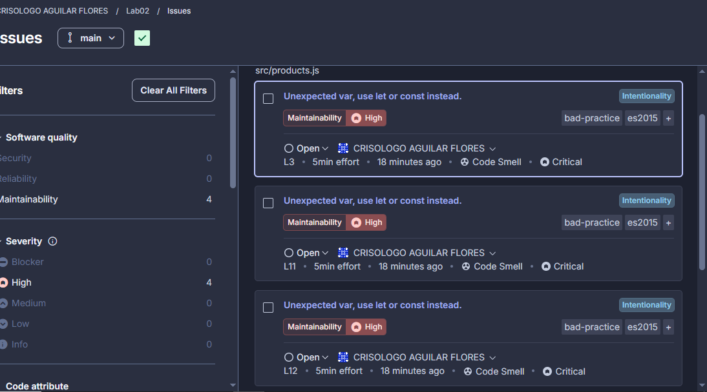

# Evidencia SonarCloud — Laboratorio 02

## Información
| Campo | Valor |
|-------|-------|
| Fecha | 09/05/2026 |
| Proyecto | Lab02 |
| URL | https://sonarcloud.io/summary/overall?id=Crisso29_Lab02 |
| QA Engineer | Crisólogo Aguilar Flores |

---

## ¿Qué es SonarCloud?

SonarCloud es una herramienta de análisis estático de código en la nube
que detecta bugs, vulnerabilidades, code smells y duplicación de código.
Se integra automáticamente con GitHub y analiza cada push que se realiza
al repositorio, generando un reporte de calidad llamado Quality Gate.

---

## ANTES de corregir

Al analizar el código defectuoso entregado por el Dev Lead, SonarCloud
detectó 4 issues de tipo Code Smell con severidad High en el archivo
src/products.js. Todos relacionados al uso de var en lugar de const/let,
lo cual viola las buenas prácticas de ES2015 y puede causar errores de
scope en el código.

❌ 4 issues de Maintainability (High)

### Issues encontrados

| # | Línea | Issue | Severidad | Tipo |
|---|-------|-------|-----------|------|
| 1 | L3 | Unexpected var, use let or const instead | High | Code Smell |
| 2 | L11 | Unexpected var, use let or const instead | High | Code Smell |
| 3 | L12 | Unexpected var, use let or const instead | High | Code Smell |
| 4 | L27 | Unexpected var, use let or const instead | High | Code Smell |

---

## DESPUÉS de corregir

Luego de aplicar las correcciones en la rama DevCrisso y mergear a main,
SonarCloud analizó nuevamente el código y no encontró ningún issue.
El Quality Gate quedó en estado OK con calificación A en todas las
métricas, lo que indica que el código cumple con los estándares de
calidad requeridos para pasar a producción.

✅ 0 issues — Quality Gate OK

### Métricas finales
| Métrica | ANTES | DESPUÉS |
|---------|-------|---------|
| Security | 0 issues — A | 0 issues — A |
| Reliability | 0 issues — A | 0 issues — A |
| Maintainability | 4 issues — A | 0 issues — A |
| Duplications | 0.0% | 0.0% |

---

## Conclusión

SonarCloud fue fundamental para confirmar los code smells detectados
por ESLint y proporcionar métricas completas de calidad del código.
Sin embargo, no detectó los defectos de lógica de negocio como precios
negativos o nulos, los cuales solo fueron detectados mediante la
revisión manual con checklist.